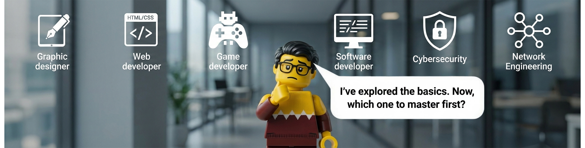

  

---

🎙️ Umm... umm... is this thing on? Testing... 1, 2... Whaaat!! they can hear me now? OK, OK.

Oh Hi! This is Navid's heart speaking. He’s currently busy typing away in his Linux terminal, so I’ll do the introductions. 

He’s a passionate Computer Engineering student actively exploring the world of software development. While he has dipped his toes into Game Dev, Web, and Graphic Design, let's be honest: my beats are completely synced with Cybersecurity and Networking. 🛡️🌐

He loves building secure, efficient systems using C++ & Python and basically lives in a Linux environment. Oh, and between you and me, he is secretly plotting to dive deep into AI for his Master's... but let's keep that our little secret for now! 🤫🤖

---

- 🔭 I’m currently working on [Hotel Management Software](https://github.com/NavidREM/hotel-management-software)

- 🌱 I’m currently learning Competitive Programming (Practicing on [Codeforces](https://codeforces.com/profile/maybe-next-time) & [LeetCode](https://www.leetcode.com/navidrem) & [Quera](https://quera.org/profile/NavidrezaEmami))

<h3 align="left">Connect with me:</h3>

 &nbsp;&nbsp;
 &nbsp;&nbsp;
 &nbsp;&nbsp;

<h3 align="left">Languages and Tools:</h3>

 
 &nbsp;
 &nbsp;
 &nbsp;
 &nbsp;
 &nbsp;
 &nbsp;

